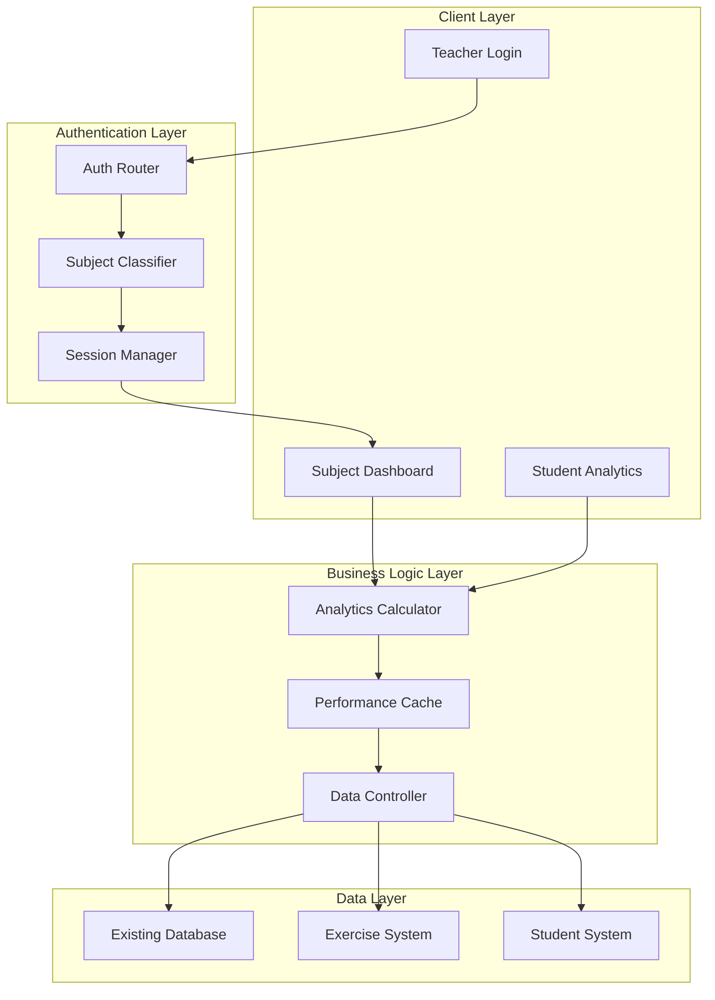

# Design Document: Teacher Authentication and Analytics

## Overview

This design implements subject-specific teacher authentication and student performance analytics for the educational platform. The system extends existing infrastructure to provide percentage-based performance calculations and role-based access control without significant database overhead.

The design leverages the current session management, websocket infrastructure, and database schema while adding minimal new components for authentication routing and analytics computation.

## Architecture

### High-Level Architecture



### Component Integration

The design integrates with existing systems:
- **Session Management**: Extends current teacher session handling
- **Database Schema**: Uses existing tables (students, exercises, sessions)
- **Real-time Infrastructure**: Leverages current websocket connections
- **UI Components**: Builds upon existing dashboard framework

## Components and Interfaces

### Authentication Components

#### SubjectAuthenticator
```typescript
interface SubjectAuthenticator {
  validateCredentials(username: string, password: string): Promise<AuthResult>
  extractSubjectArea(username: string): SubjectArea
  createSubjectSession(teacherId: string, subject: SubjectArea): Promise<Session>
}

interface AuthResult {
  success: boolean
  teacherId?: string
  subjectArea?: SubjectArea
  errorMessage?: string
}
```

#### SubjectRouter
```typescript
interface SubjectRouter {
  routeToSubjectDashboard(session: Session): string
  validateSubjectAccess(teacherId: string, requestedData: DataRequest): boolean
  filterDataBySubject(data: StudentData[], subject: SubjectArea): StudentData[]
}
```

### Analytics Components

#### PerformanceCalculator
```typescript
interface PerformanceCalculator {
  calculatePercentage(achievedPoints: number, totalPoints: number): number
  computeClassStatistics(studentData: StudentData[]): ClassStatistics
  generateProgressTrend(studentId: string, timeRange: TimeRange): ProgressData
}

interface ClassStatistics {
  average: number
  median: number
  range: { min: number, max: number }
  distribution: PerformanceRange[]
}
```

#### AnalyticsCache
```typescript
interface AnalyticsCache {
  getCachedStatistics(cacheKey: string): ClassStatistics | null
  setCachedStatistics(cacheKey: string, stats: ClassStatistics, ttl: number): void
  invalidateCache(pattern: string): void
}
```

### Dashboard Components

#### SubjectDashboard
```typescript
interface SubjectDashboard {
  renderSubjectView(subject: SubjectArea, teacherId: string): DashboardView
  displayFilteredStudents(students: StudentData[]): StudentList
  showSubjectAnalytics(analytics: ClassStatistics): AnalyticsView
}
```

## Data Models

### Extended Authentication Model
```typescript
interface TeacherCredentials {
  username: string        // Format: subjectxxx (e.g., infoxxx, matekxxx)
  password: string
  subjectArea: SubjectArea
}

enum SubjectArea {
  INFORMATICS = 'info',
  MATHEMATICS = 'matek',
  LANGUAGE = 'nyelv',
  SCIENCE = 'termeszet',
  HISTORY = 'tortenelem'
}

interface SubjectSession extends Session {
  teacherId: string
  subjectArea: SubjectArea
  permissions: SubjectPermissions
}
```

### Analytics Data Models
```typescript
interface StudentPerformance {
  studentId: string
  subjectArea: SubjectArea
  achievedPoints: number
  totalPossiblePoints: number
  percentageScore: number    // Calculated dynamically
  lastUpdated: Date
}

interface ProgressPoint {
  date: Date
  percentageScore: number
  exerciseCount: number
}

interface PerformanceRange {
  range: string             // e.g., "90-100%", "80-89%"
  studentCount: number
  percentage: number
}
```

### Cache Models
```typescript
interface CacheEntry {
  key: string
  data: any
  timestamp: Date
  ttl: number              // Time to live in minutes
}

interface AnalyticsCacheKey {
  subjectArea: SubjectArea
  timeRange: string
  dataType: 'statistics' | 'progress' | 'comparison'
}
```