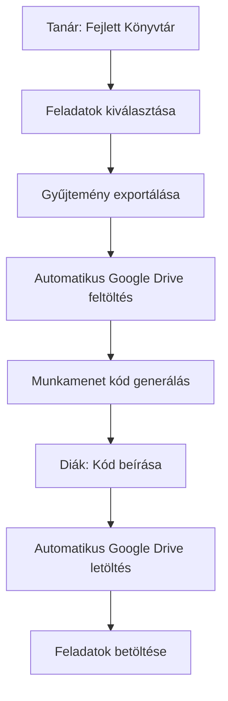

# Google Drive API Beállítás

Ez az útmutató segít beállítani a Google Drive API-t a JSON fájlok automatikus megosztásához.

## Miért Google Drive?

- **Gyors**: Diákok azonnal letölthetik a JSON fájlokat
- **Megbízható**: Google infrastruktúra
- **Ingyenes**: 15GB tárhely
- **Automatikus**: Tanár exportál → automatikus feltöltés → diák automatikus letöltés

## 1. Google Cloud Console Beállítás

### 1.1 Projekt létrehozása
1. Menj a [Google Cloud Console](https://console.cloud.google.com/)-ra
2. Hozz létre új projektet: "Okos Gyakorló"
3. Válaszd ki a projektet

### 1.2 Drive API engedélyezése
1. Menj a "APIs & Services" > "Library"-ba
2. Keress rá: "Google Drive API"
3. Kattints "Enable"-re

### 1.3 API Key létrehozása
1. Menj a "APIs & Services" > "Credentials"-ba
2. Kattints "Create Credentials" > "API Key"
3. Másold ki az API key-t
4. Kattints "Restrict Key"-re:
   - Application restrictions: "HTTP referrers"
   - Website restrictions: Add meg a domain-t (pl. `nyirad.vercel.app`)
   - API restrictions: "Google Drive API"

## 2. Google Drive Mappa Beállítás

### 2.1 Mappa létrehozása
1. Menj a [Google Drive](https://drive.google.com/)-ra
2. Hozz létre új mappát: "Okos-Gyakorlo-Sessions"
3. Jobb klikk a mappán > "Share"
4. Állítsd be: "Anyone with the link can view"
5. Másold ki a mappa ID-t az URL-ből:
   ```
   https://drive.google.com/drive/folders/1ABC123DEF456GHI789
                                        ↑ Ez a Folder ID
   ```

## 3. Vercel Környezeti Változók

Menj a Vercel Dashboard-ra > Settings > Environment Variables:

```bash
GOOGLE_DRIVE_API_KEY=AIzaSyC...your_api_key
GOOGLE_DRIVE_FOLDER_ID=1ABC123DEF456GHI789
```

## 4. Tesztelés

### 4.1 Fejlett Könyvtár Teszt
1. Menj a Fejlett Könyvtár-ba
2. Válassz ki feladatokat
3. Kattints "Gyűjtemény exportálása"-ra
4. Ellenőrizd, hogy megjelenik-e a munkamenet kód

### 4.2 Diák Teszt
1. Diák módban írd be a munkamenet kódot
2. Ellenőrizd, hogy gyorsan betöltődnek-e a feladatok
3. Console-ban látnod kell: "✅ Session JSON loaded from Google Drive"

## 5. Hibaelhárítás

### API Key hibák
- Ellenőrizd, hogy a domain restriction helyes-e
- Győződj meg róla, hogy a Drive API engedélyezve van

### Mappa hozzáférési hibák
- Ellenőrizd, hogy a mappa publikus-e
- Győződj meg róla, hogy a Folder ID helyes

### Vercel hibák
- Ellenőrizd a környezeti változókat
- Nézd meg a Vercel function logs-okat

## 6. Működési Folyamat



## 7. Előnyök

- **Tanár**: Egy kattintással megosztja a feladatokat
- **Diák**: Gyors betöltés, nincs várakozás
- **Rendszer**: Kevesebb API terhelés, jobb teljesítmény
- **Megbízhatóság**: Google infrastruktúra

## 8. Biztonsági Megjegyzések

- Az API key csak olvasási jogosultságot ad
- A fájlok automatikusan törlődnek 7 nap után
- Csak a munkamenet kóddal lehet hozzáférni a fájlokhoz